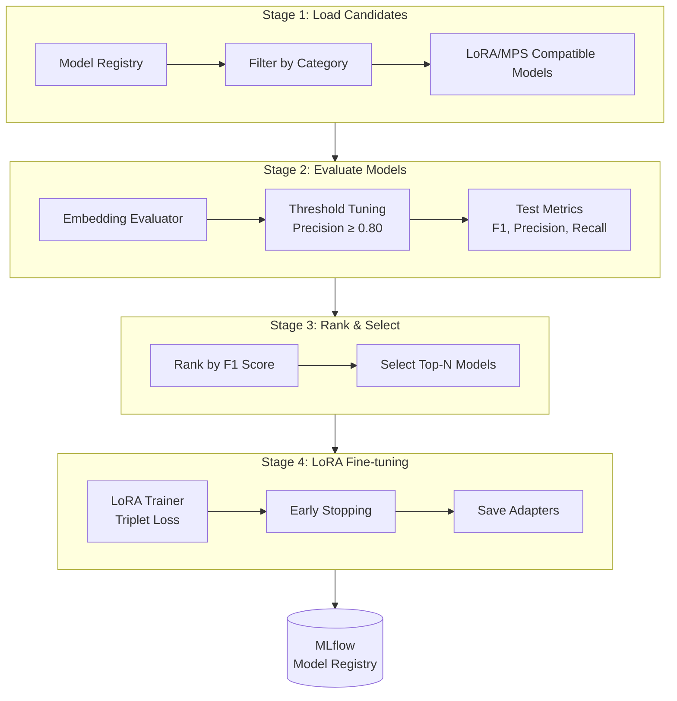

# Privacy-Aware Semantic Cache

A multi-layered framework for building and evaluating privacy-preserving semantic caches for Large Language Model (LLM) queries. This project integrates automated embedding model evaluation, federated learning, and secure semantic similarity detection.

---

## Core Components

### 1. Embedding Model Evaluation Pipeline
> [!NOTE]
> This section describes the automated pipeline for evaluating and fine-tuning embedding models for semantic similarity detection.

A multi-stage pipeline for evaluating and fine-tuning embedding models for semantic similarity detection in a privacy-aware semantic cache.

#### Overview

This pipeline implements a systematic approach to identifying and enhancing the best embedding models for detecting semantically similar queries. The pipeline:

1. **Evaluates** multiple embedding models from a curated registry
2. **Optimizes** similarity thresholds to meet precision constraints
3. **Ranks** models by F1 score and selects top performers
4. **Fine-tunes** selected models using LoRA (Low-Rank Adaptation)

**Built with:** [Prefect](https://www.prefect.io/) for orchestration and [MLflow](https://mlflow.org/) for experiment tracking.

#### Pipeline Architecture



#### Key Features

- **Precision-Constrained Threshold Optimization**: Enforces minimum precision constraint (default: ≥0.80) to prevent false cache hits.
- **Triplet-Based Evaluation**: Uses cosine similarity between embedded queries (Anchor, Positive, Negative).
- **LoRA Fine-Tuning**: Efficient adaptation of large embedding models using Low-Rank Adaptation.
- **MLflow Integration**: Full tracking of metrics, parameters, and LoRA adapter artifacts.

#### Usage

```python
from embedding_pipeline.flows.main_flow import embedding_evaluation_pipeline

# Run full pipeline
result = embedding_evaluation_pipeline(
    model_categories=["fast", "balanced", "quality"],
    min_precision=0.80,
    top_n=3,
)
```

#### Configuration
Key settings in `embedding_pipeline/config/pipeline_config.py`:
- `min_precision`: Default 0.80
- `top_n`: Default 3
- `lora_r`: Default 16

See [embedding_pipeline/README.md](embedding_pipeline/README.md) for detailed architecture and [embedding_pipeline/docs/RESULTS.md](embedding_pipeline/docs/RESULTS.md) for evaluation and fine-tuning results.

### 2. Federated Learning System
> [!NOTE]
> This section describes the privacy-preserving federated learning framework for collaborative model improvement.

A system built on [Flower](https://flower.ai/) that enables multiple clients to refine a shared embedding model using local data without compromising privacy.

#### Key Features
- **LoRA-Based Collaboration**: Only tiny adapter weights are exchanged, minimizing communication and keeping the base model frozen.
- **Differential Privacy (DP-SGD)**: Optional formal privacy guarantees using [Opacus](https://opacus.ai/) to protect against weight-based data reconstruction.
- **Tripplet loss training**: Fine-tunes embeddings specifically for semantic similarity intent.
- **PEFT Integration**: Full compatibility with HuggingFace's Parameter-Efficient Fine-Tuning library.

See [federated_learning/README.md](federated_learning/README.md) for architecture details, design decisions (like why we freeze LoRA-A), and simulation guides.

---
