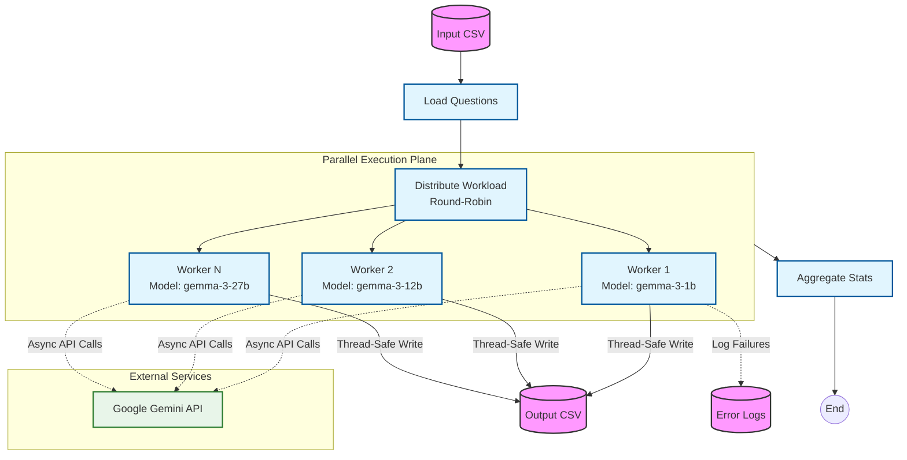
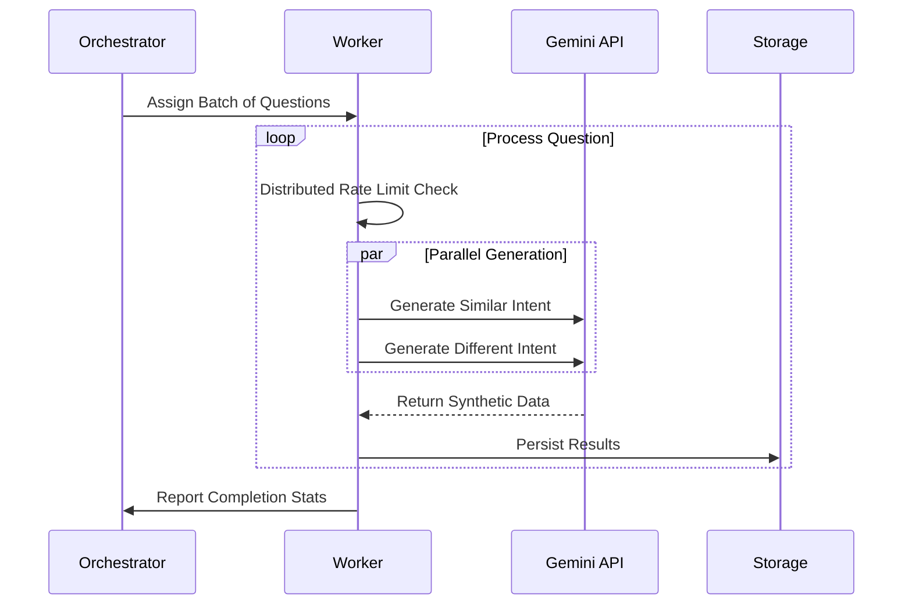

# Synthetic Data Generator

An asynchronous, distributed pipeline for generating synthetic semantic datasets using Google Gemini models. This tool automates the creation of training data that teaches embedding models to understand semantic intent variations. It's needed in this project for building robust semantic caching systems.

The pipeline generates these variations automatically by:

1. Taking seed questions as input
2. Generating semantically **similar** variations (positive training pairs)
3. Generating semantically **different** questions with overlapping keywords (hard negatives)
4. Aggregating labeled training data ready for embedding model evaluation and fine-tuning

Without good hard negatives, embedding models optimize for keyword similarity rather than semantic understanding.

## System Architecture

This is built on a distributed worker model managed by a central graph orchestrator. It's designed for throughput while maintaining API rate limit compliance.

### High-Level Components



### Logical Flow

#### 1. Worker Lifecycle

The architecture isolates execution into independent workers. Each worker manages its own state, ensuring that failures or delays in one model do not impact the overall pipeline throughput.



#### 2. Concurrency Model

The pipeline uses a **hybrid concurrency model** to balance I/O efficiency with API rate limits:

- **Process Level**: The main Python process runs the LangGraph orchestrator sequentially through pipeline stages.
- **Worker Level (Multi-Tasking)**: Multiple `ModelWorker` instances run concurrently using `asyncio`, each handling a batch of questions.
- **Request Level (Fan-Out)**: For every single question, we launch **2 parallel LLM requests** (one for "similar", one for "different"). This doubles the effective throughput per worker while respecting individual rate limits.

**Why this layering?** It allows us to decouple API request pacing (per-worker clock-based throttling) from orchestration complexity (simple sequential stages). Each worker independently manages its rate limit—no global locking, no central bottleneck.

#### 3. Distributed Throttling

For simplicity we use **Clock-Based Throttling** within each worker. Each worker tracks the time of its last API call and enforces a minimum interval between requests:

```text
T_wait = max(0, (60 / RPM_limit) * 2 - (T_now - T_last))
```

### LangGraph Orchestration

LangGraph (`langgraph.graph.StateGraph`) was chosen for pipeline orchestration, with explicit nodes for load → distribute → run_workers → aggregate.

- Provides clean state management and data flow tracking
- Makes the pipeline serializable and inspectable (could add persistence/resumption later)
- Separates orchestration concerns from worker logic
- Offers hooks for monitoring, retries, and debugging

### When This Breaks

#### API Rate Limits (Gemini API hitting quotas)

You'll see questions start failing with "quota exceeded" errors. The issue is that the Gemini API enforces quotas in multiple ways—not just RPM, but also total tokens per day and limits on concurrent requests. Our clock-based throttling handles RPM fine, but it's blind to quota windows and token budgets. If you hit this, try reducing `llm_rpm_limit` or adding a delay between worker starts to spread API calls across the quota window more evenly.

#### Parser Failures on Unexpected LLM Output

Sometimes you'll see a high failure rate with errors like "Expected 1 questions, got 0". This happens when the model outputs something the parser doesn't expect—maybe a preamble like "Here are the questions:" before the actual list. Our parser is strict about formatting: it wants clean output, one question per line. You can either refine the prompts to be more explicit about the format, or make the parser more lenient (though there's a risk of accepting malformed data if you do).

#### Memory Usage with Large Datasets

If you're working with 100k+ questions, you might see the Python process balloon to GB+ of RAM. That's because we load all questions into memory at once in `load_input_questions`, keep the entire list in pipeline state, and accumulate results as we go. For large-scale runs, consider switching to generators or streaming instead of loading everything upfront.

### Tradeoffs You'll Notice Here

| Tradeoff | Choice | Why | Cost |
| --- | --- | --- | --- |
| **Simplicity vs. Load Balancing** | Round-robin (simple) | Reproducibility, no complexity | Uneven workload if models have different speeds |
| **Centralized vs. Distributed Throttling** | Distributed (per-worker) | No locking, fault isolation | Harder to enforce strict global rate limits |
| **Memory vs. Speed** | Load all questions upfront | Simpler orchestration, better for typical dataset sizes | Memory issues with 1M+ questions |
| **Strictness vs. Robustness** | Fail on parse errors | Data quality assurance | Rejects edge cases, higher failure rate |
| **Async vs. Sync** | Async (asyncio) | Throughput via concurrent I/O | Complexity, fewer familiar patterns for developers |

---

## Integration Points

This generator feeds directly into the embedding model evaluation pipeline:

1. **Output CSV** → `embedding_pipeline/evaluation/` for threshold tuning and model ranking
2. **Metrics** (processed/failed counts) → Tracked in experiment metadata for reproducibility
3. **Configuration** (model_list, rpm_limit) → Should align with embedding pipeline's expected LoRA config

The generator is a data production stage in the broader flow:  
**Data Generation** → **Embedding Evaluation** → **Federated Learning**

---

## Getting Started

### Running the Generator

```bash
# Activate environment
source .venv/bin/activate

# Set API key
export GEMINI_API_KEY="your-key-here"

# Run with defaults
python -m data.synthetic_data_generator.main

# Or customize via config
python -c "
from data.synthetic_data_generator.config import PipelineConfig
from data.synthetic_data_generator.graph import build_pipeline_graph

config = PipelineConfig(
    input_file='data/raw/my_questions.csv',
    output_file='data/generated_data/my_dataset.csv',
    model_list=['gemma-3-12b-it'],  # Single model for testing
    llm_rpm_limit=10,
)
pipeline = build_pipeline_graph(config)
pipeline.invoke({'questions': [], 'model_assignments': {}, 'worker_results': [], 
                 'total_processed': 0, 'total_failed': 0, 'total_generated': 0})
"
```

### Input Format

CSV with headers: `qid`, `question`

```csv
qid,question
1,What is the price?
2,How do I install Python?
```

### Monitoring & Debugging

- **Enable logging**: Set `PREFECT_LOGGING_LEVEL=DEBUG` for verbose output (if integrated with Prefect)
