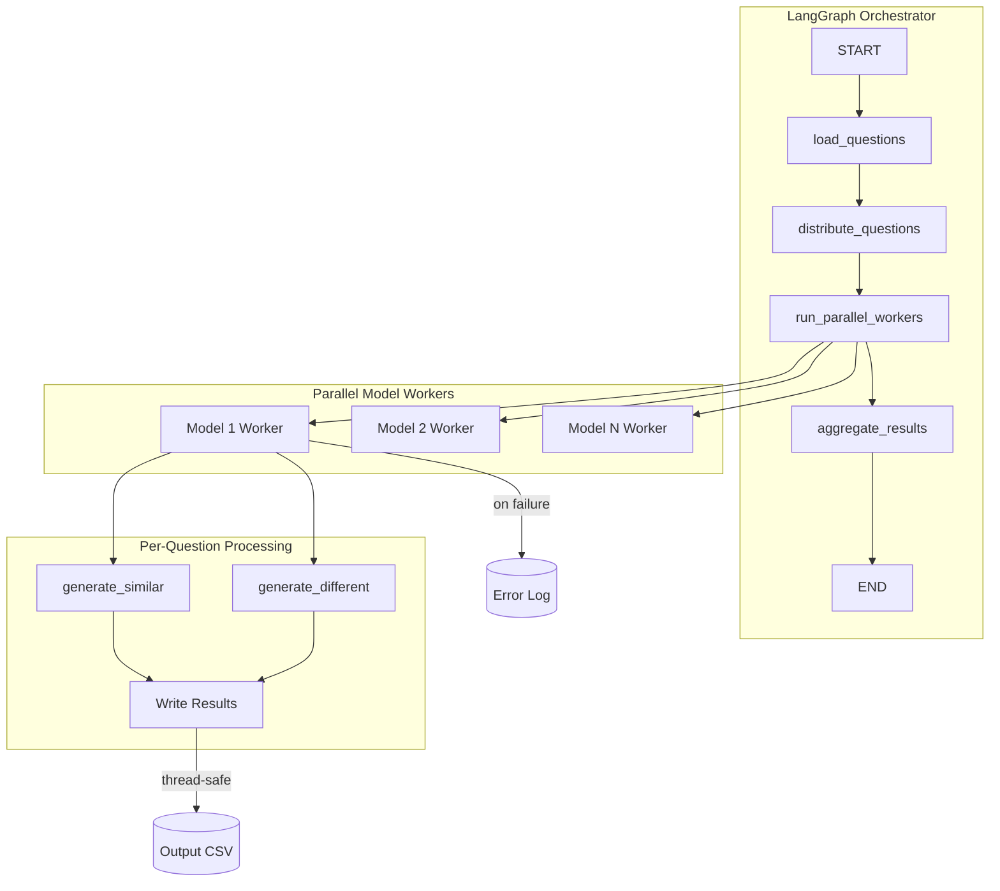
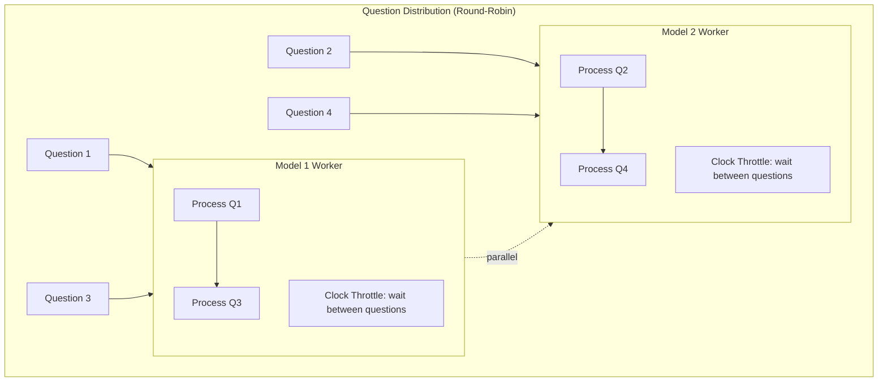

# Synthetic Data Generator

A LangGraph-based pipeline for generating synthetic question data using Google Gemini models.

## Overview

This pipeline takes a dataset of questions and generates two types of synthetic data for each input question:

1. **Semantically Similar Questions** (configurable count): Questions with the same intent that would expect the same answer
2. **Different Intent Questions** (configurable count): Questions that look similar (share keywords/topic) but have different meaning

## Architecture

### Pipeline Flow



### Parallel Execution Model



## Key Design Decisions

### True Parallel Execution
All configured models run concurrently. Questions are distributed upfront using round-robin, and each model processes its assigned questions independently.

### Clock-Based Throttling

We chose a simple clock-based approach over traditional rate limiting (e.g., token bucket algorithm) for the following reasons:

**Why not Token Bucket?**
- Token bucket requires tracking token counts, refill rates, and timestamps
- Needs async locks for thread-safe token acquisition
- Adds complexity for burst handling and token recovery logic
- Overkill when we have predictable, steady workloads

**Clock-Based Approach:**
- Formula: `min_interval = 60 / RPM * 2` (accounting for 2 LLM calls per question)
- Each worker simply tracks `last_call_time` and sleeps if the interval hasn't passed
- Implementation is ~5 lines of code vs. a full rate limiter class
- Guarantees we stay under RPM limits without complex state management

**Example:** With RPM=30, each question requires 2 API calls, so we wait 4 seconds between questions. This ensures we never exceed 30 requests per minute per model.

### Concurrent Per-Question Processing
Within each worker, the two LLM calls (similar + different) run concurrently for each question using `asyncio.gather()`.

### Thread-Safe File Writes
A single `threading.Lock` is shared across all workers to prevent race conditions when writing to the output CSV.

### Error Isolation
Failures in one worker don't affect others. Failed question IDs are logged to a separate file for retry.

## Configuration

Configuration is defined in `config.py`:

| Parameter | Default | Description |
|-----------|---------|-------------|
| `input_file` | `data/raw/small_final_questions.csv` | Input CSV with questions |
| `output_file` | `data/generated_data/synthetic_questions.csv` | Output CSV path |
| `model_list` | `["gemma-3-4b-it"]` | Gemini models to use |
| `llm_rpm_limit` | 15 | Requests per minute per model |
| `similar_count` | 2 | Similar questions to generate |
| `different_count` | 3 | Different intent questions to generate |

## Input/Output Format

**Input CSV:**
```
qid,question
721163,What is an embedding problem?
```

**Output CSV:**
```
id,original_question,generated_question,is_semantically_similar
721163_0,What is an embedding problem?,What does an embedding problem mean?,True
721163_1,What is an embedding problem?,Could you explain embedding problems?,True
721163_2,What is an embedding problem?,How do I solve embedding problems?,False
```

## Running the Pipeline

```bash
python -m data.synthetic_data_generator.main
```

## Error Handling

Failed questions are logged to `logs/failed_questions.log` with format:
```
timestamp,qid,error_message
```