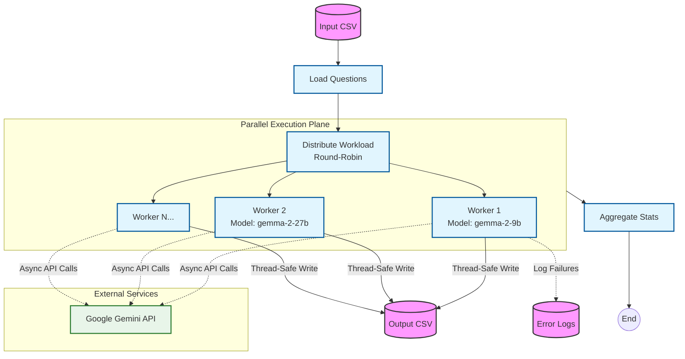
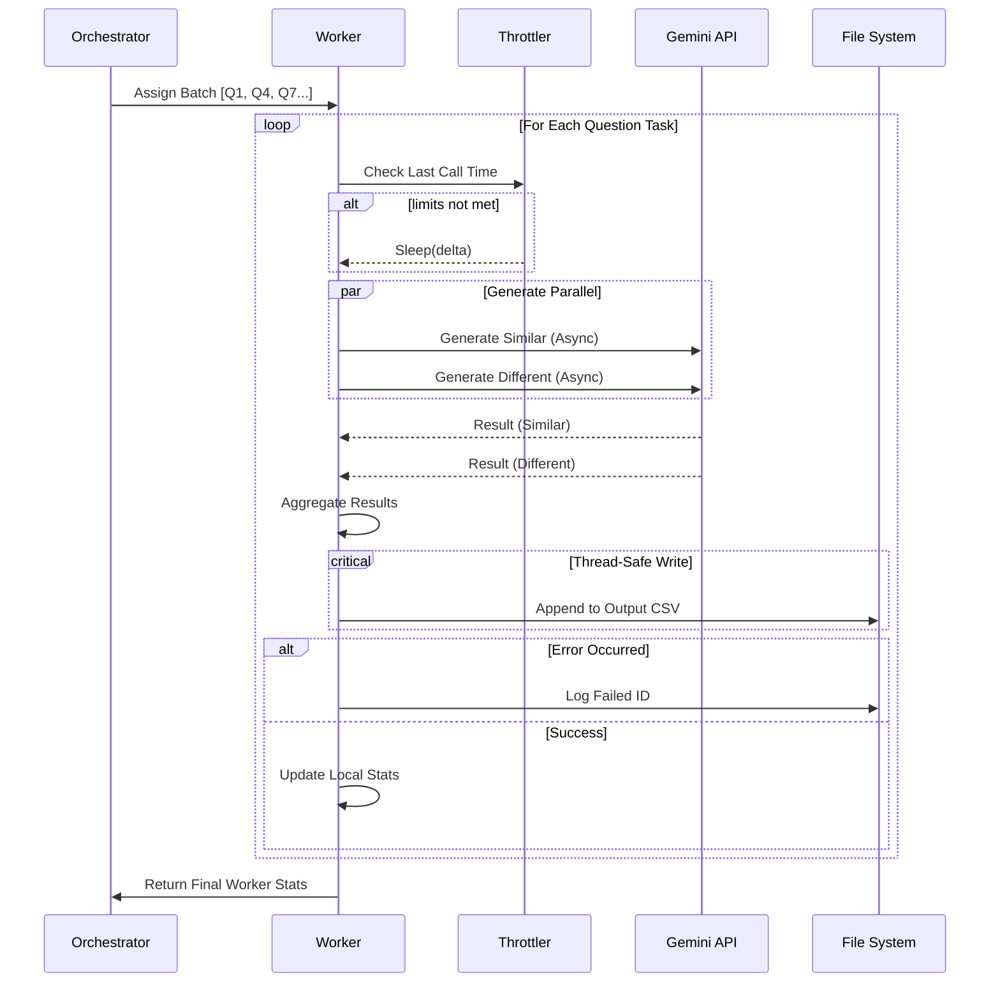

# Synthetic Data Generator

A high-performance, asynchronous pipeline for generating synthetic datasets using Google Gemini models. This tool mimics real-world user intent variations to robustly train semantic search and cache systems.

## Overview

The pipeline transforms a seed list of questions into a rich dataset by generating two variants for every input:
1.  **Semantically Similar Questions:** Different phrasing, same intent (Positive pairs for contrastive learning).
2.  **Different Intent Questions:** Similar keywords/topic, distinct meaning (Hard negatives).

It employs a **Map-Reduce** style architecture orchestrated by **LangGraph**, utilizing true parallelism across multiple model workers to maximize throughput while adhering to strict rate limits.

---

## System Architecture

The system is built on a distributed worker model managed by a central graph orchestrator.

### High-Level Components



---

## Detailed Execution Flow

### 1. The Worker Lifecycle
Each worker operates independently on its assigned slice of the dataset. It manages its own rate limiting (Clock-based Throttling) and concurrency.



### 2. Concurrency Model

The pipeline utilizes a hybrid concurrency model to balance I/O binding and API limits:

*   **Process Level**: The main Python process runs the LangGraph orchestrator.
*   **Worker Level (Multi-Tasking)**: Multiple `ModelWorker` instances run concurrently using `asyncio`. While Python is single-threaded, `asyncio` allows us to interleave network requests waiting times effectively.
*   **Request Level (Fan-Out)**: For every single question, we launch **2 parallel LLM requests** (one for "similar", one for "different"). This doubles the effective IOPS per worker.

### 3. Clock-Based Throttling
Unlike token-bucket algorithms which can be complex to sync across async tasks, we use a robust **Time-Delta Throttling** mechanism.

$$ \large T_{wait} = \max(0, \frac{60}{RPM_{limit}} - (T_{now} - T_{last})) $$

This ensures that even with network jitter, a single worker **mathematically cannot** exceed its assigned Requests Per Minute (RPM), providing safe compliance with API quotas.

---

## Configuration & Usage

Configuration is managed in `config.py`.

| Parameter | Description | Impact |
| :--- | :--- | :--- |
| `model_list` | List of Gemini model versions to use. | **Scalability**: Adding models linearly increases total system throughput. |
| `llm_rpm_limit` | Max requests per minute **per model**. | **Speed**: Higher limits = faster completion, lower limits = safer from 429 errors. |
| `similar_count` | Number of positive examples per question. | **Dataset Size**: Controls the "width" of the positive dataset. |
| `different_count` | Number of hard negatives per question. | **Dataset Size**: Controls the "width" of the negative dataset. |

### Running the Pipeline
```bash
# Ensure you are in the project root
python -m data.synthetic_data_generator.main
```

### Data output Format
The output CSV is generated in real-time. Loops are protected by a `threading.Lock` to ensure row integrity.

```csv
id,original_question,generated_question,is_semantically_similar
101_0,What is embeddings?,Explain vector embeddings.,True
101_1,What is embeddings?,How to use Word2Vec?,False
```

## 🐛 Error Handling & Recovery

*   **Granular Failure**: If a specific question fails (e.g., safety filter block), only that question is dropped. The pipeline **does not stop**.
*   **Logging**: Failed Question IDs are written to `logs/failed_questions.log`.
*   **Recovery**: You can easily inspect the log, create a new CSV with just those IDs, and re-run the pipeline to retry.