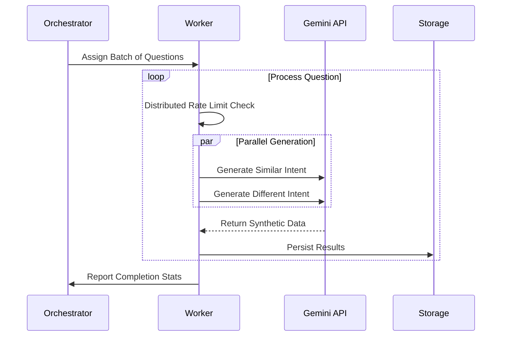

# Synthetic Data Generator

A high-performance, asynchronous pipeline for generating synthetic datasets using Google Gemini models. This tool mimics real-world user intent variations to robustly train semantic search and cache systems.

## Overview & Data Strategy

High-quality semantic search requires more than just keyword matching. This pipeline automates the creation of a sophisticated training dataset by generating specific semantic variants for each seed question.

| Data Type | Definition | Architectural Purpose |
| :--- | :--- | :--- |
| **Similar Intent** | Different phrasing, same meaning. | **Positive Pairs**: Teaches the model that "How much is this?" and "What's the price?" are identical requests, improving recall. |
| **Different Intent** | Shared keywords, different meaning. | **Hard Negatives**: Teaches the model to distinguish subtler nuances (e.g., "Install python" vs "Uninstall python"), reducing false positives. |

It employs a **Map-Reduce** style architecture orchestrated by **LangGraph**, utilizing true parallelism across multiple model workers to maximize throughput while adhering to strict rate limits.

---

## System Architecture

The system is built on a distributed worker model managed by a central graph orchestrator.

### High-Level Components

---

## Logical Flow

### 1. The Worker Lifecycle
The architecture isolates execution into independent workers. Each worker manages its own state, ensuring that failures or delays in one model do not impact the overall pipeline thoughtput.

### 2. Concurrency Model

The pipeline utilizes a hybrid concurrency model to balance I/O binding and API limits:

*   **Process Level**: The main Python process runs the LangGraph orchestrator.
*   **Worker Level (Multi-Tasking)**: Multiple `ModelWorker` instances run concurrently using `asyncio`.
*   **Request Level (Fan-Out)**: For every single question, we launch **2 parallel LLM requests** (one for "similar", one for "different"). This doubles the effective IOPS per worker.

### 3. Distributed Throttling
Unlike traditional centralized rate limiters, this architecture uses a simplified Clock-Based Throttling within each worker.

$$ \large T_{wait} = \max(0, \frac{60}{RPM_{limit}} - (T_{now} - T_{last})) $$

This ensures that every model stays mathematically within its API quotas (Requests Per Minute) regardless of network latency or jitter, without the need for complex locking mechanisms.