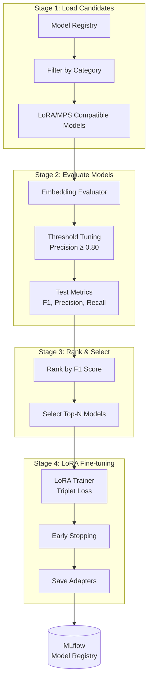

# Embedding Model Evaluation Pipeline

A multi-stage pipeline for evaluating and fine-tuning embedding models for semantic similarity detection in a privacy-aware semantic cache.

## Overview

This pipeline implements a systematic approach to identifying and enhancing the best embedding models for detecting semantically similar queries. The pipeline:

1. **Evaluates** multiple embedding models from a curated registry
2. **Optimizes** similarity thresholds to meet precision constraints
3. **Ranks** models by F1 score and selects top performers
4. **Fine-tunes** selected models using LoRA (Low-Rank Adaptation)

**Built with:** [Prefect](https://www.prefect.io/) for orchestration and [MLflow](https://mlflow.org/) for experiment tracking.

## Pipeline Architecture



## Key Features

### Model Registry
The pipeline includes 17+ curated embedding models across four categories:

| Category | Description | Example Models |
|----------|-------------|----------------|
| **Fast** | Optimized for speed (<200MB) | MiniLM-L6, MiniLM-L12 |
| **Balanced** | Good speed-quality tradeoff | MPNet-Base, DistilRoBERTa, BGE-Small |
| **Quality** | Best performance (larger models) | RoBERTa-Large, E5-Large, BGE-Large, Instructor-Large |
| **Multilingual** | Multi-language support | LaBSE, Paraphrase-Multilingual |

### Precision-Constrained Threshold Optimization
- Searches threshold range (0.50 - 0.99) to maximize F1 score
- Enforces minimum precision constraint (default: ≥0.80)
- Prevents false cache hits in the semantic cache

### Triplet-Based Evaluation
Uses triplet data format:
- **Anchor**: Original query
- **Positive**: Semantically similar query
- **Negative**: Semantically different query

Evaluates using cosine similarity between embedded queries.

### LoRA Fine-Tuning
- **Rank (r):** 16
- **Alpha:** 32
- **Dropout:** 0.1
- **Target Modules:** query, key, value, dense layers
- **Loss Function:** Triplet margin loss
- **Early Stopping:** Patience-based on validation loss

### MLflow Integration
- Logs all evaluation metrics and parameters
- Stores trained LoRA adapters as artifacts
- Tracks threshold tuning results and comparison reports

## Usage

### Running the Full Pipeline

```python
from embedding_pipeline.flows.main_flow import embedding_evaluation_pipeline

result = embedding_evaluation_pipeline(
    model_categories=["fast", "balanced", "quality"],
    min_precision=0.80,
    top_n=3,
)
```

### Quick Test (Development)

```python
from embedding_pipeline.flows.main_flow import quick_test_pipeline

result = quick_test_pipeline()  # Uses fast models, minimal samples
```

### Evaluation Only (Skip LoRA)

```python
from embedding_pipeline.flows.main_flow import evaluation_only_pipeline

results = evaluation_only_pipeline(
    model_categories=["balanced"],
    min_precision=0.80,
)
```

## Configuration

Key configuration options in `config/pipeline_config.py`:

| Setting | Default | Description |
|---------|---------|-------------|
| `min_precision` | 0.80 | Minimum precision constraint |
| `top_n` | 3 | Number of models for LoRA training |
| `threshold_range` | (0.50, 0.99) | Search range for threshold tuning |
| `lora_r` | 16 | LoRA rank |
| `max_epochs` | 2 | Maximum LoRA training epochs |
| `patience` | 1 | Early stopping patience |

### Environment Variable Overrides

```bash
export MLFLOW_TRACKING_URI="http://localhost:5001"
export PIPELINE_MIN_PRECISION=0.85
export PIPELINE_TOP_N=5
```

## Project Structure

```
embedding_pipeline/
├── config/
│   └── pipeline_config.py       # Pipeline configuration
├── evaluation/
│   ├── embedding_evaluator.py   # Model evaluation logic
│   ├── threshold_tuner.py       # Threshold optimization
│   └── metrics_calculator.py    # F1, precision, recall calculation
├── flows/
│   ├── main_flow.py             # Main pipeline orchestration
│   ├── evaluation_flow.py       # Evaluation sub-flow
│   ├── ranking_flow.py          # Ranking sub-flow
│   └── lora_training_flow.py    # LoRA training sub-flow
├── lora_training/
│   ├── lora_trainer.py          # LoRA fine-tuning trainer
│   └── model_saver.py           # Model saving utilities
├── mlflow_integration/
│   ├── experiment_manager.py    # MLflow experiment setup
│   ├── run_logger.py            # Metric and artifact logging
│   └── model_registry_client.py # Model registry operations
├── ranking/
│   ├── model_ranker.py          # Model ranking logic
│   └── comparison_report.py     # Report generation
├── registry/
│   ├── model_registry.py        # Available models registry
│   └── model_info.py            # Model metadata dataclass
├── outputs/
│   └── models/                  # Trained LoRA adapters
└── docs/
    └── RESULTS.md               # Evaluation results
```

## Results

See [docs/RESULTS.md](docs/RESULTS.md) for detailed evaluation and fine-tuning results.
