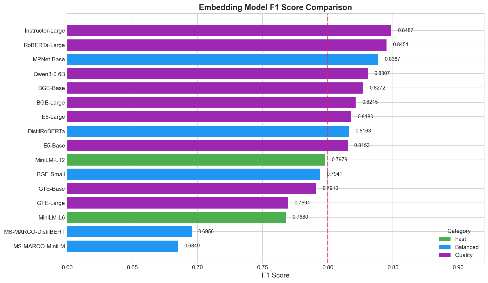
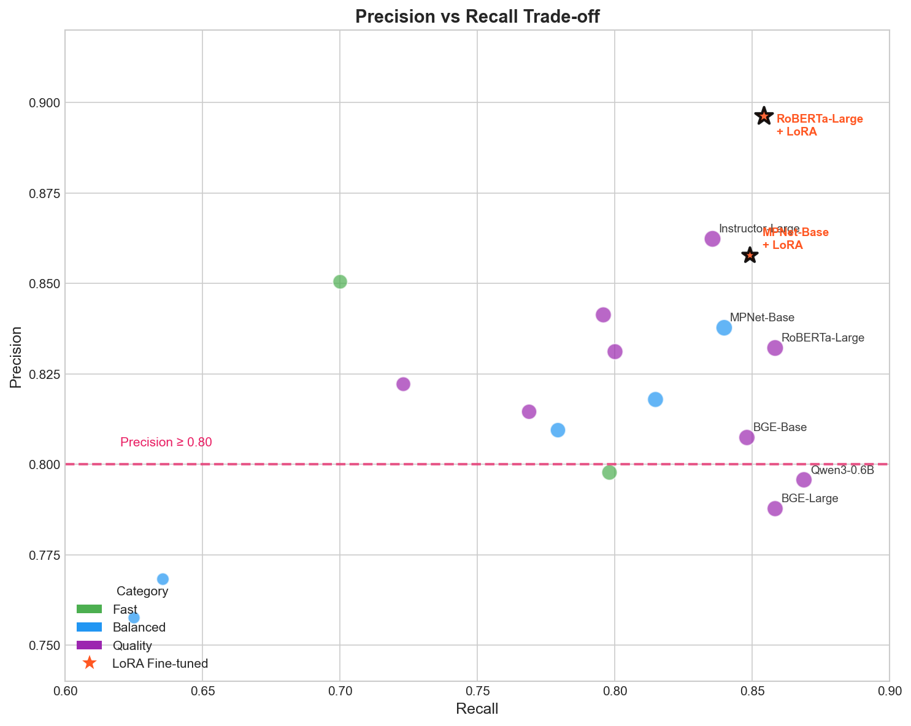
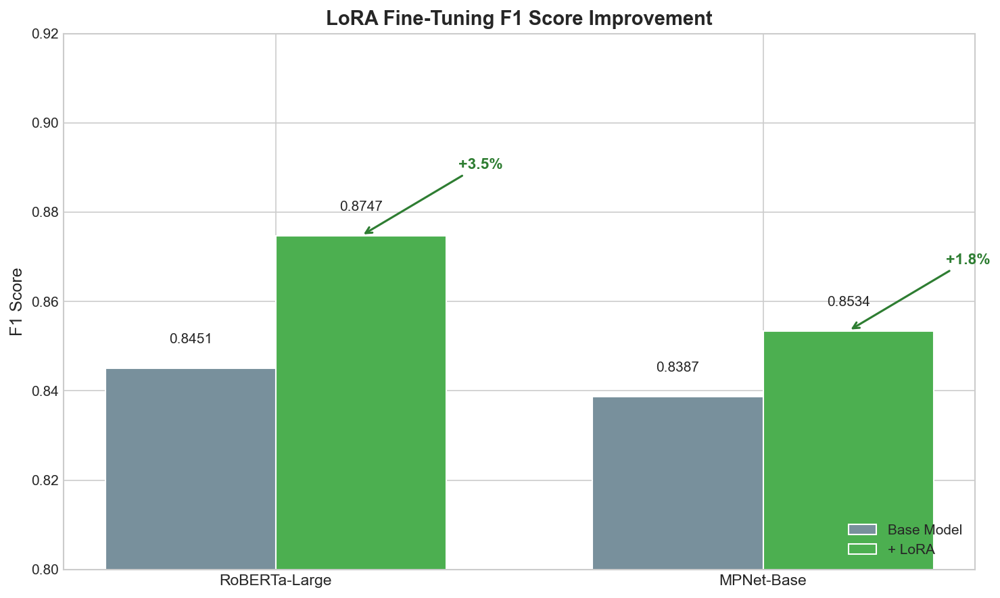

# Embedding Pipeline Results

Evaluation and LoRA fine-tuning results from the embedding model pipeline.

**Evaluation Date:** January 2026  
**Precision Constraint:** ≥ 0.80  
**Dataset:** Custom triplet data for semantic similarity

---

## Model Evaluation Results

16 models were successfully evaluated. Models are ranked by F1 score on the test set.

### Top Performers

| Rank | Model | Category | Dim | F1 Score | Precision | Recall | Threshold | Triplet Acc |
|:----:|-------|----------|:---:|:--------:|:---------:|:------:|:---------:|:-----------:|
| 1 | Instructor-Large | quality | 768 | **0.8487** | 0.8624 | 0.8354 | 0.970 | 0.9750 |
| 2 | RoBERTa-Large | quality | 1024 | **0.8451** | 0.8323 | 0.8583 | 0.730 | 0.9667 |
| 3 | MPNet-Base | balanced | 768 | **0.8387** | 0.8378 | 0.8396 | 0.740 | 0.9688 |
| 4 | Qwen3-Embedding-0.6B | quality | 1024 | 0.8307 | 0.7958 | 0.8688 | 0.770 | 0.9417 |
| 5 | BGE-Base | quality | 768 | 0.8272 | 0.8075 | 0.8479 | 0.800 | 0.9542 |

### Full Results

| Model | Category | Dim | F1 Score | Precision | Recall | Threshold |
|-------|----------|:---:|:--------:|:---------:|:------:|:---------:|
| Instructor-Large | quality | 768 | 0.8487 | 0.8624 | 0.8354 | 0.970 |
| RoBERTa-Large | quality | 1024 | 0.8451 | 0.8323 | 0.8583 | 0.730 |
| MPNet-Base | balanced | 768 | 0.8387 | 0.8378 | 0.8396 | 0.740 |
| Qwen3-Embedding-0.6B | quality | 1024 | 0.8307 | 0.7958 | 0.8688 | 0.770 |
| BGE-Base | quality | 768 | 0.8272 | 0.8075 | 0.8479 | 0.800 |
| BGE-Large | quality | 1024 | 0.8215 | 0.7878 | 0.8583 | 0.800 |
| E5-Large | quality | 1024 | 0.8180 | 0.8414 | 0.7958 | 0.910 |
| DistilRoBERTa | balanced | 768 | 0.8163 | 0.8180 | 0.8146 | 0.710 |
| E5-Base | quality | 768 | 0.8153 | 0.8312 | 0.8000 | 0.910 |
| MiniLM-L12 | fast | 384 | 0.7979 | 0.7979 | 0.7979 | 0.740 |
| BGE-Small | balanced | 384 | 0.7941 | 0.8095 | 0.7792 | 0.830 |
| GTE-Base | quality | 768 | 0.7910 | 0.8146 | 0.7688 | 0.910 |
| GTE-Large | quality | 1024 | 0.7694 | 0.8223 | 0.7229 | 0.920 |
| MiniLM-L6 | fast | 384 | 0.7680 | 0.8506 | 0.7000 | 0.760 |
| MS-MARCO-DistilBERT | balanced | 768 | 0.6956 | 0.7683 | 0.6354 | 0.640 |
| MS-MARCO-MiniLM | balanced | 384 | 0.6849 | 0.7576 | 0.6250 | 0.670 |

---

## LoRA Fine-Tuning Results

Top models were selected for LoRA fine-tuning to boost performance.

### Training Configuration

| Parameter | Value |
|-----------|-------|
| LoRA Rank (r) | 16 |
| LoRA Alpha | 32 |
| LoRA Dropout | 0.1 |
| Learning Rate | 2e-4 |
| Batch Size | 8 |
| Max Epochs | 2 |
| Loss Function | Triplet Margin Loss |

### Performance Improvement

#### RoBERTa-Large

| Metric | Base Model | + LoRA | Improvement |
|--------|:----------:|:------:|:-----------:|
| **F1 Score** | 0.8451 | **0.8747** | +3.5% |
| Precision | 0.8323 | **0.8962** | +7.7% |
| Recall | 0.8583 | 0.8542 | -0.5% |
| Accuracy | — | 0.8776 | — |

#### MPNet-Base

| Metric | Base Model | + LoRA | Improvement |
|--------|:----------:|:------:|:-----------:|
| **F1 Score** | 0.8387 | **0.8534** | +1.8% |
| Precision | 0.8378 | **0.8579** | +2.4% |
| Recall | 0.8396 | 0.8490 | +1.1% |
| Accuracy | — | 0.8542 | — |

### Best LoRA Models Summary

| Model | Base F1 | LoRA F1 | ∆ F1 | Final Precision | Optimal Threshold |
|-------|:-------:|:-------:|:----:|:---------------:|:-----------------:|
| **RoBERTa-Large + LoRA** | 0.8451 | **0.8747** | +3.5% | 0.8962 | 0.736 |
| MPNet-Base + LoRA | 0.8387 | 0.8534 | +1.8% | 0.8579 | 0.730 |

---

## Key Findings

### Base Model Performance
1. **Instructor-Large** achieves the highest base F1 (0.8487) but was not selected for LoRA due to architecture constraints
2. **RoBERTa-Large** and **MPNet-Base** are the best LoRA-compatible models
3. Quality-tier models generally outperform balanced/fast models

### LoRA Fine-Tuning Impact
1. **Precision significantly improved** — RoBERTa-Large precision increased from 0.8323 to 0.8962 (+7.7%)
2. **F1 score consistently improved** — Both models showed F1 gains (+1.8% to +3.5%)
3. **Optimal thresholds shifted lower** — Post-LoRA thresholds moved from 0.73-0.74 to maintain precision

### Recommendations
- **For production:** Use **RoBERTa-Large + LoRA** (F1=0.8747, Precision=0.8962)
- **For lower latency:** Use **MPNet-Base + LoRA** (smaller model, F1=0.8534)
- **Threshold:** Set similarity threshold around **0.73-0.74** for fine-tuned models

---

## MLflow Experiments

Results tracked in MLflow under:
- `Semantic_Cache_Evaluation_v2/01_threshold_tuning` — Model evaluations
- `Semantic_Cache_Evaluation_v2/02_model_ranking` — Ranking results
- `Semantic_Cache_Evaluation_v2/03_lora_training` — LoRA training runs
