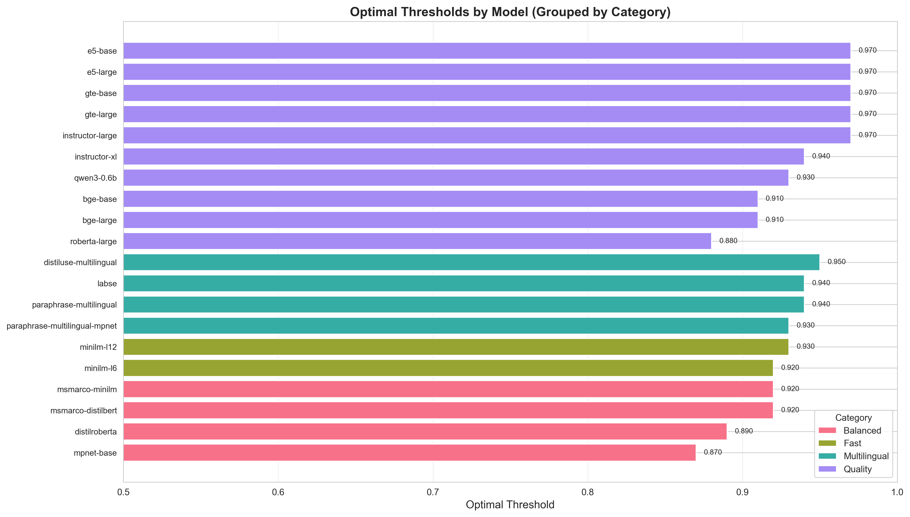

# Embedding Models Evaluation Report

**Generated:** 2025-10-30 21:44:21

## Configuration

- **Optimization Metric:** f1
- **Minimum Precision Constraint:** 0.8
- **Training Samples:** 2000
- **Total Models Evaluated:** 20

## Executive Summary

### Best Performing Models

- **Best F1 Score:** `roberta-large` - F1: 0.7009 (Precision: 0.8084, Recall: 0.6187)
- **Best Precision:** `instructor-xl` - Precision: 0.8267 (F1: 0.6200)
- **Best Recall:** `roberta-large` - Recall: 0.6187 (F1: 0.7009)

### Overall Statistics

- **Average F1 Score:** 0.4736 ± 0.1363
- **Average Precision:** 0.8129 ± 0.0078
- **Average Recall:** 0.3503 ± 0.1435
- **Average Optimal Threshold:** 0.9315 ± 0.0303

## Visualizations

### 1. Optimal Thresholds by Model Category

This chart shows the optimal similarity thresholds for each model, grouped by category (fast, balanced, quality, multilingual). Higher thresholds indicate the model requires stronger similarity before marking questions as duplicates.

### 2. Model Performance Comparison

Comparison of precision, recall, and F1 scores across all models. Models are sorted by F1 score (ascending).

### 3. Precision vs Recall Trade-off

This scatter plot visualizes the precision-recall trade-off for each model. The diagonal lines represent constant F1 scores. Models in the upper-right corner achieve the best balance.

### 4. Confusion Matrices - Top Performers

Confusion matrices for the top 6 models by F1 score, showing:
- **TN (True Negatives):** Correctly identified non-duplicates
- **FP (False Positives):** Non-duplicates incorrectly marked as duplicates (cache false hits)
- **FN (False Negatives):** Duplicates incorrectly marked as non-duplicates (cache misses)
- **TP (True Positives):** Correctly identified duplicates

### 5. Performance by Category

Average performance metrics and optimal thresholds grouped by model category.

## Detailed Results

### Top 10 Models by F1 Score

| Rank | Model | Category | Dim | Threshold | Precision | Recall | F1 Score |
|------|-------|----------|-----|-----------|-----------|--------|----------|
| 1 | `roberta-large` | Quality | 1024 | 0.880 | 0.8084 | 0.6187 | **0.7009** |
| 2 | `mpnet-base` | Balanced | 768 | 0.870 | 0.8059 | 0.5813 | **0.6754** |
| 3 | `instructor-large` | Quality | 768 | 0.970 | 0.8113 | 0.5560 | **0.6598** |
| 4 | `instructor-xl` | Quality | 768 | 0.940 | 0.8267 | 0.4960 | **0.6200** |
| 5 | `distilroberta` | Balanced | 768 | 0.890 | 0.8077 | 0.4760 | **0.5990** |
| 6 | `bge-large` | Quality | 1024 | 0.910 | 0.8246 | 0.4640 | **0.5939** |
| 7 | `bge-base` | Quality | 768 | 0.910 | 0.8080 | 0.4600 | **0.5862** |
| 8 | `paraphrase-multilingual-mpnet` | Multilingual | 768 | 0.930 | 0.8005 | 0.3960 | **0.5299** |
| 9 | `minilm-l6` | Fast | 384 | 0.920 | 0.8161 | 0.3373 | **0.4774** |
| 10 | `gte-large` | Quality | 1024 | 0.970 | 0.8224 | 0.2840 | **0.4222** |

### Performance by Category

#### Fast Models

| Model | Dimension | Threshold | Precision | Recall | F1 Score |
|-------|-----------|-----------|-----------|--------|----------|
| `minilm-l6` | 384 | 0.920 | 0.8161 | 0.3373 | 0.4774 |
| `minilm-l12` | 384 | 0.930 | 0.8092 | 0.2827 | 0.4190 |

#### Balanced Models

| Model | Dimension | Threshold | Precision | Recall | F1 Score |
|-------|-----------|-----------|-----------|--------|----------|
| `mpnet-base` | 768 | 0.870 | 0.8059 | 0.5813 | 0.6754 |
| `distilroberta` | 768 | 0.890 | 0.8077 | 0.4760 | 0.5990 |
| `msmarco-minilm` | 384 | 0.920 | 0.8009 | 0.2360 | 0.3646 |
| `msmarco-distilbert` | 768 | 0.920 | 0.8226 | 0.2040 | 0.3269 |

#### Quality Models

| Model | Dimension | Threshold | Precision | Recall | F1 Score |
|-------|-----------|-----------|-----------|--------|----------|
| `roberta-large` | 1024 | 0.880 | 0.8084 | 0.6187 | 0.7009 |
| `instructor-large` | 768 | 0.970 | 0.8113 | 0.5560 | 0.6598 |
| `instructor-xl` | 768 | 0.940 | 0.8267 | 0.4960 | 0.6200 |
| `bge-large` | 1024 | 0.910 | 0.8246 | 0.4640 | 0.5939 |
| `bge-base` | 768 | 0.910 | 0.8080 | 0.4600 | 0.5862 |
| `gte-large` | 1024 | 0.970 | 0.8224 | 0.2840 | 0.4222 |
| `qwen3-0.6b` | 1024 | 0.930 | 0.8203 | 0.2800 | 0.4175 |
| `gte-base` | 768 | 0.970 | 0.8118 | 0.2760 | 0.4119 |
| `e5-base` | 768 | 0.970 | 0.8227 | 0.2227 | 0.3505 |
| `e5-large` | 1024 | 0.970 | 0.8112 | 0.1547 | 0.2598 |

#### Multilingual Models

| Model | Dimension | Threshold | Precision | Recall | F1 Score |
|-------|-----------|-----------|-----------|--------|----------|
| `paraphrase-multilingual-mpnet` | 768 | 0.930 | 0.8005 | 0.3960 | 0.5299 |
| `paraphrase-multilingual` | 384 | 0.940 | 0.8106 | 0.2853 | 0.4221 |
| `distiluse-multilingual` | 512 | 0.950 | 0.8085 | 0.2027 | 0.3241 |
| `labse` | 768 | 0.940 | 0.8090 | 0.1920 | 0.3103 |

## Recommendations

### For Production Use

Based on the evaluation results:

1. **Best Overall Balance:** `roberta-large` offers the best F1 score (0.7009) with strong precision (0.8084) and recall (0.6187).

2. **For Speed-Critical Applications:** Consider models from the "fast" category if latency is a primary concern.

3. **For High-Precision Requirements:** If minimizing false positives (incorrect cache hits) is critical, consider `instructor-xl` with precision of 0.8267.

4. **For High-Recall Requirements:** If minimizing false negatives (cache misses) is critical, consider `roberta-large` with recall of 0.6187.

### Threshold Tuning

- The optimal thresholds range from 0.870 to 0.970
- Models with higher thresholds are more conservative (fewer false positives, more false negatives)
- Models with lower thresholds are more aggressive (more false positives, fewer false negatives)

### Next Steps

1. **Validation Testing:** Validate top models on a held-out test set
2. **Latency Benchmarking:** Measure inference time for production workload
3. **A/B Testing:** Deploy top 2-3 candidates for real-world testing
4. **Fine-tuning:** Consider fine-tuning top models on domain-specific data

## Raw Data

Complete results are available in `threshold_tuning_all_models.json`.

---

*Report generated by Privacy-Aware Semantic Cache Evaluation Framework*
